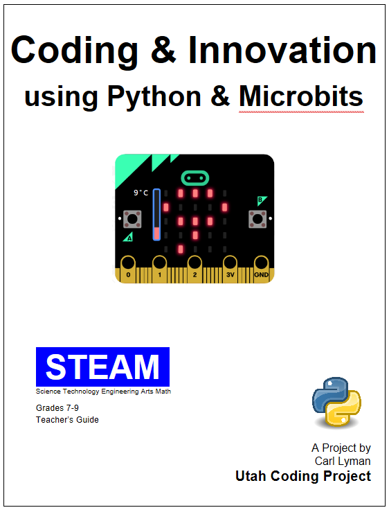

# Coding & Innovation using Microbits & Python
- by Carl Lyman
- May 2019
CC By NC SA

[00 Overview - Table of Contents](00overview/0.0overview.md)

## Overview
This is an introduction to coding and computer science by way of making and design, using the revolutionary new **Microbit** microcontroller board, and **MicroPython** coding environment. It is a project-based curriculum with a maker philosophy at its core; the idea is that by making physical objects, students create a context to learn computer science concepts, to think creatively, to code, and to become innovative. This project is a Python version of the same book that was written for Microsoft's MakeCode. 
[Codding & Innovation using Microbits](https://sites.google.com/view/utahcodingproject/microbits/coding-innovation) 

### Credits: 
This project heavily utilizes the open source work done by Douglas & Mary Kiang who wrote the course “Intro to CS using Micro:bits”. It is published by Microsoft MakeCode team and Microbit.org. https://makecode.microbit.org/courses/csintro 

